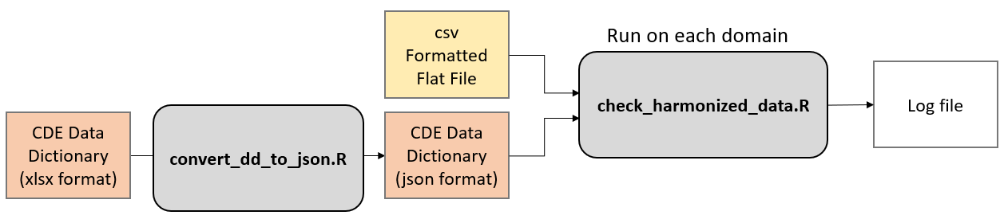
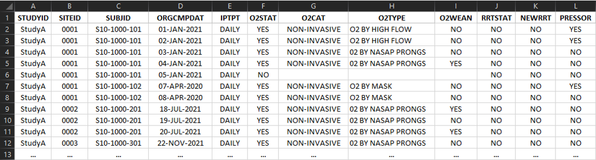
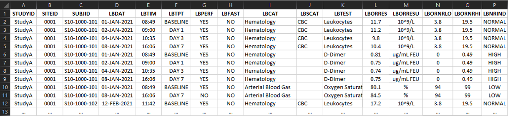
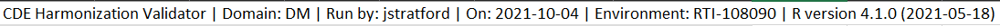
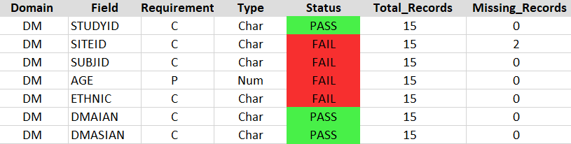
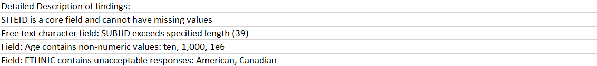

# [CDE Harmonization Validator](https://github.com/RTIInternational/NHLBI-CONNECTS/blob/main/R/check_harmonized_data.R)

The National Heart, Lung, and Blood Institute (NHLBI) Collaborating Network of Networks for Evaluating COVID-19 and Therapeutic Strategies ([CONNECTS](https://nhlbi-connects.org/1)) project formed with the aim of helping prevent infection, slow or halt disease progression, and speed recovery. CONNECTS studies conduct tests to determine if medications are safe and can help individuals recover from COVID-19. 

## Table of contents
* [Data Standards](#data-standards)
* [Data Harmonization](#data-harmonization)
* [Data Quality](#data-quality)
* [QC Evaluation](#qc-evaluation)
* [Validation Workflow](#validation-workflow)
* [Requirements](#requirements)
* [Installation](#installation)
* [Usage](#usage)
* [Examples](#examples)
* [Input file list format](#input-formats)
* [Output](#output)
* [Authors](#authors)
* [Acknowledgments](#acknowledgments)

## Data Standards
One standardization approach is using clearly defined variables with specific response values common to multiple data sets across different studies and is termed common data elements (CDEs). CDEs improve data interoperability in accordance with the [FAIR principles (Findable, Accessible, Interoperable, Reusable) of scientific data management](https://www.go-fair.org/). Collecting study data with CDEs reduces barriers to collaboration and increases adoption and data sharing across sites, projects, consortia, and over time by ensuring that the data is consistently collected. A concise set of [COVID-19 CDEs for clinical research](https://nhlbi-connects.org/common_data_elements) were developed for NHLBI to facilitate data standardization across emerging studies. Many benefits of adopting CDEs have been previously elaborated; however, our experience has reinforced many of these benefits including enabling alignment with other sources of evidence including ‘real-world data’, electronic health records, patient reported outcomes, and mobile/wearable devices through linkage of CDEs to controlled vocabularies and terminologies. 

## Data Harmonization
Standardizing existing and emerging study data to CDEs produces analysis-ready datasets and maximizes data sharing and reuse, but requires labor-intensive, yet essential, task of data harmonization. Typically, harmonization is characterized by manually mapping each study variable from one study to another or to a standardized set of CDEs, resulting in a protocol-specific harmonization template. Study teams then transformed the raw (collected) data according to the harmonization template. 

## Data Quality
An essential component of data harmonization is the establishment of quality control (QC) checks. Programmatic evaluation of each CDE domain using an R script can be used to evaluate the data structure (e.g., presence of required columns, data format (type and length), compliance with controlled response options, and proportion of observations missing). The automated error detection approach results in time and resource savings and allowed database curators to efficiently and effectively identify missing or incorrect values to better direct curation efforts. Furthermore, this approach enables comprehensive quality control evaluation, rather than spot checks of identified issues, confirming that fixes do not introduce new issues in previously evaluated fields, resulting in the highest quality datasets. 

## QC Evaluation
CONNECTS created automated scripts to assess QC metrics and report issues to address these concerns and reduce the time/effort/cost of manual quality checks. The R scripts produce a domain-specific log for each data domain (e.g., vital signs, concomitant medications, hospitalization) indicating a pass/fail/warning status and description for each field. Domain-specific logs are aggregated as tabs in a single Microsoft Excel workbook for ease of review. If data issues were identified during validation, the study teams implement a correction, and the validation begins anew. These scripts can be run locally or on [BioData Catalyst Powered by Seven Bridges Platform](https://biodatacatalyst.nhlbi.nih.gov/).  

## Validation Workflow
<p align="left">
  
</p>

## Requirements
This package was tested using R version 4.1.0 n the linux command line
#### 1) Software environment
```
- Unix/Linux System or a terminal in R Studio
- R 4.1.0 or above 
```
* Required R packages
```
- getopt
- jsonlite
- openxlsx
```

#### 2) Required inputs
* JSON formatted Common Data Elements dictionary
* CSV formatted Study Data 

#### 3) Additional files
* convert_dd_to_json.R - This is a helper script for converting the [official CDE data dictionary](https://nhlbi-connects.org/common_data_elements#) to json format
```
- An Excel file (.xlsx) defining the common data elements for connects studies
```

## Installation
Install R following the recommended installation instructions
* https://cran.r-project.org/
* For Ubuntu users: https://cran.r-project.org/bin/linux/ubuntu/README.html

Install required R packages
```
R
install.packages('getopt', dependencies = T)
install.packages('jsonlite', dependencies = T)
install.packages('openxlsx', dependencies = T)
```

Install CDE Harmonization Validator
```
wget --no-check-certificate https://github.com/RTIInternational/NHLBI-CONNECTS/archive/master.zip -O /opt/CDE_harmonization_validator.zip
unzip /opt/CDE_harmonization_validator.zip -d /opt/CDE_harmonization_validator
```

## Usage
Here is a flow diagram showing the processing of samples through the CNV Radar workflow. 

<p align="left">
  
</p>

Thus the user will need to modify these commands accordingly. 

#### 1) Generate a json formatted CDE data dictionary for each domain
```
Usage: 
cd <working directory>
Rscript /opt/CDE_harmonization_validator/convert_dd_to_json.R -i <excel workbook>.xlsx -s DM
```

* Required arguments
```
-i FILE		  An excel file for the CDE data dictionary downloaded from https://nhlbi-connects.org/common_data_elements

-s string		The name of the domain that you would like to use for creating the data dictionary
```
* Optional arguments
```
-p DIR	    An output directory
-o    		A name to give the output file  
-v        	A flag that indicates providing more verbose logging
```

#### 2) Perform the validation check
```
Usage: 
cd <working directory>
Rscript /opt/CDE_harmonization_validator/check_harmonized_data.R -i <harmonized data>.csv -d <domain> -j <data dictionary>.json -s <study type (IP, OP, D, or N)>
```

* Required arguments
```
-i FILE		  A csv formatted file of harmonized data for a domain
-j FILE		  A json formatted data dictionary created using convert_dd_to_json.R for the appropriate domain
-d          The abbreviation of the domain that you are validating
-s          Study type (IP, OP, D, N) for determining which CDEs are mandatory
```
* Optional arguments
```
-p DIR	    An output directory
-o    		  A name to give the output file  
-E        	A flag for whether to create an excel formatted output
-v        	A flag that indicates providing more verbose logging
```
## Examples
## Input Formats
#### CDE Data Dictionary
The CDE data dictionary can be downloaded from the [CONNECTS CDE](https://nhlbi-connects.org/common_data_elements) web portal
#### Study Data
The CSV formatted data is either a wide (One row per participant per timepoint with one column per variable) or tall (One row per event per participant per timepoint) format for each domain as described in the header of the respective domain within the excel workbook. 
- Variable names are to be used for the column headers

Wide Format:
<p align="left">
  
</p>

Tall Format:
<p align="left">
  
</p>

## Output
The main output from the script is a log file that describes an violations of the harmonized data formats. 

#### 1) \<DATE\>_CDE_harmonization_validator_\<DOMAIN\>.log or \<DATE\>_CDE_harmonization_validator_\<DOMAIN\>.xlsx
This output file consists of three sections
1. Header - contains information about how the script was run

|     Element     | Description                                     |
|:---------------:|-------------------------------------------------|
|     Tool Name   | "CDE Harmonization Validator"                   |
|      Domain     | Domain provided on the command line arguments   |
|       User      | The username provided by the system             |
|       Date      | The Date in format YYYY-MM-DD                   |
|   Environment   | The name of the machine running the script      |
|    R Version    | The version of R that is used to run the script |

Example:
<p align="left">
  
</p>

2. Field Summary - contains information about each field in the domain and whether it meets the harmonization criteria

|     Column      | Description                                                                                           |
|:---------------:|-------------------------------------------------------------------------------------------------------|
|     Domain      | Domain provided on the command line arguments                                                         |
|      Field      | The name of the variables described in the data dictionary                                            |
|   Requirement   | The **C**ore, **P**referred, or **O**ptional classification of the variable for the study type provided in the command line arguments|
|      Type       | The format of the variable specified in the data dictionary (Note that date and time formats are listed as "Char")|
|     Status      | Pass or Fail status assigned to the field by the validator                                            |
|  Total_Records  | Total number of non-blank entries for the field                                                       |
| Missing_Records | Total number of blank entries in the field                                                            |

Example:
<p align="left">
  
</p>

3. Description of warnings and errors - description of any violations to the harmonization criteria
Log messages that were generated by the script describing the fields that violated harmonization crtieria and any other additional relevant information

Example:
<p align="left">
  
</p>

## Feedback
Yes! Please give us your feedback, raise issues, and let us know how the tool is working for you. Pull requests are welcome.

## Authors
Software developers: Jeran Stratford

## Acknowledgments
We'd like to thank the CONNECTS data standards and harmonization core, as well as the BioData Catalyst team. 
