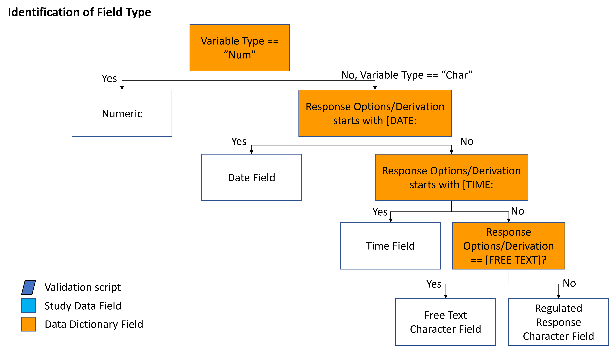
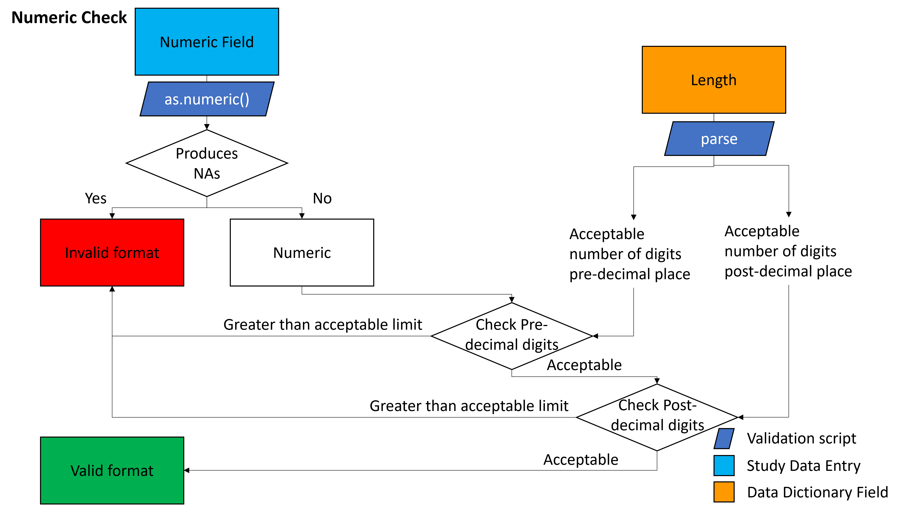
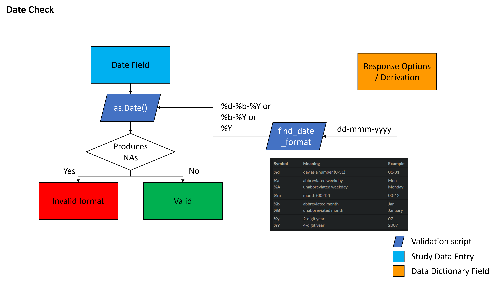
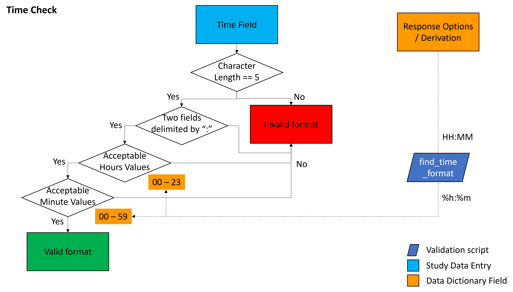
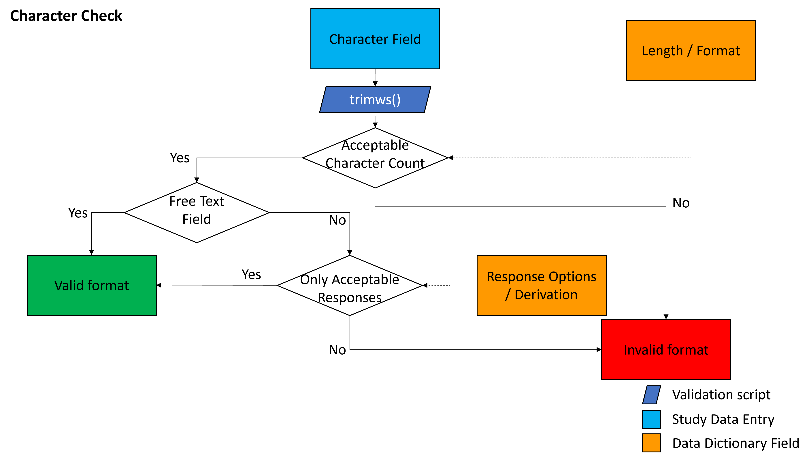
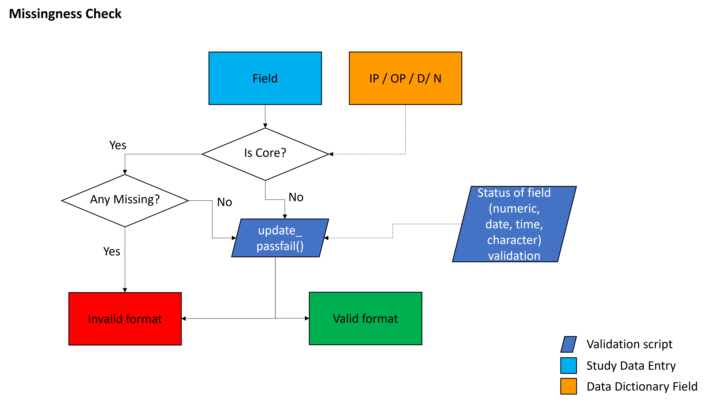

## Table of contents
* [Type of Field Determination](#data_types)
* [Numeric](#numeric_fields)
* [Date](#date_fields)
* [Time](#time_fields)
* [Character](#character_fields)
* [Missingness](#missingness)

## What type of field is this

  

## Numeric Fields

  

## Date Fields

  

## Time Fields

  

## Character Fields

  

## Missing Data

  

