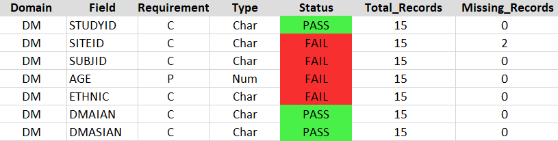
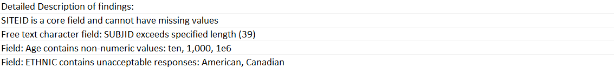

## Output
The main output from the script is a log file that describes an violations of the harmonized data formats. 

#### 1) \<DATE\>_CDE_harmonization_validator_\<DOMAIN\>.log or \<DATE\>_CDE_harmonization_validator_\<DOMAIN\>.xlsx
This output file consists of three sections
1. Header - contains information about how the script was run

|     Element     | Description                                     |
|:---------------:|-------------------------------------------------|
|     Tool Name   | "CDE Harmonization Validator"                   |
|      Domain     | Domain provided on the command line arguments   |
|       User      | The username provided by the system             |
|       Date      | The Date in format YYYY-MM-DD                   |
|   Environment   | The name of the machine running the script      |
|    R Version    | The version of R that is used to run the script |

Example:

  

2. Field Summary - contains information about each field in the domain and whether it meets the harmonization criteria

|     Column      | Description                                                                                           |
|:---------------:|-------------------------------------------------------------------------------------------------------|
|     Domain      | Domain provided on the command line arguments                                                         |
|      Field      | The name of the variables described in the data dictionary                                            |
|   Requirement   | The **C**ore, **P**referred, or **O**ptional classification of the variable for the study type provided in the command line arguments|
|      Type       | The format of the variable specified in the data dictionary (Note that date and time formats are listed as "Char")|
|     Status      | Pass or Fail status assigned to the field by the validator                                            |
|  Total_Records  | Total number of non-blank entries for the field                                                       |
| Missing_Records | Total number of blank entries in the field                                                            |

Example:

  

3. Description of warnings and errors - description of any violations to the harmonization criteria
Log messages that were generated by the script describing the fields that violated harmonization crtieria and any other additional relevant information

Example:

  

