# Running the validation tool at [BioData Catalyst](https://biodatacatalyst.nhlbi.nih.gov/)

The [CONNECTS CDE Harmonization Validation tool](https://github.rti.org/jstratford/CDE_Harmonization_Validator) is an NHLBI funded script developed by the Data Standards and Harmonization Core to assess the accuracy of transforming study data to the CONNECTS COVID-19 **C**ommon **D**ata **E**lements ([CDEs](https://nhlbi-connects.org/common_data_elements)). This script is written in R and is intended to be run on the linux command line. As CONNECTS studies are destined to be available at [BioData Catalyst](https://biodatacatalyst.nhlbi.nih.gov/) this vignette covers how to run the software within the BDC environment.


## Table of contents
* [Requirements](#requirements)
* [File Upload](#upload)
* [Cloud Compute Setup](#cloud_computing_setup)
* [File System](#file_system)
* [Usage](#usage)
* [Examples](#examples)
* [Outputs](#outputs)

## Requirements
#### 1) BDC Ecosystem
Access to the BioData Catalyst powered by Seven Bridges platform. You can sign up for a free account here. It is preferred that you use your ERA commons account, but it is not a requirement. 
- https://era.nih.gov/register-accounts/create-and-edit-an-account.htm
- https://biodatacatalyst.nhlbi.nih.gov/contact/ecosystem/

#### 2) There exists a BDC project where the analysis can take place.
The following files will be [uploaded](#upload) into the project
1. A directory of .csv formatted harmonized study data. One file for each CDE domain.
2. The [json formatted CDE data dictionary](https://nhlbi-connects.org/common_data_elements) for the CDE version used in the harmonization
3. The [CDE harmonization validator](https://github.rti.org/jstratford/CDE_Harmonization_Validator) script 

The first step in the process will be to login to [BDC powered by Seven Bridges](https://platform.sb.biodatacatalyst.nhlbi.nih.gov/). Typically this is done by using ones ERA commons credentials 
<p align="left">
  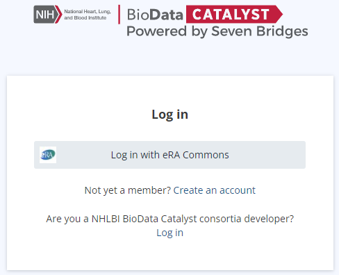
</p>

## File Upload
Once you have logged into the BDC ecosystem and navigated to the BDC project for this analysis you will need to upload files into the project. The first step in the process is to click on the "Files" tab from the landing portal.
<p align="left">
  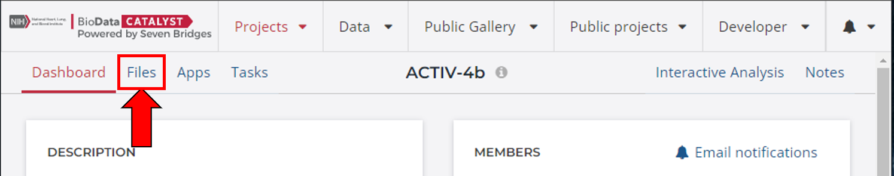
</p>
#### 1) The .json formatted CONNECTS CDE data dictionary
Click on the "+ Add file" button in the upper right of the window. From the drop down select the "FTP / HTTP".

<p align="left">
  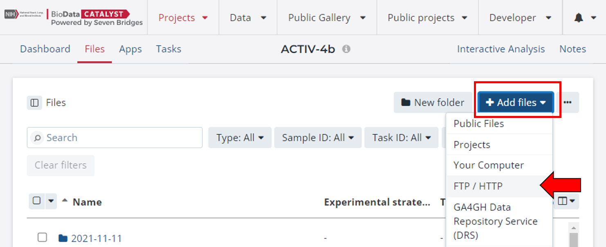
</p>

Paste the path to the .json formatted data dictionary for the CDE version used during the harmonization into the top box. Provide metadata tags for the file as appropriate and select an option for resolving instances where the filename already exists within the BDC project. 

<p align="left">
  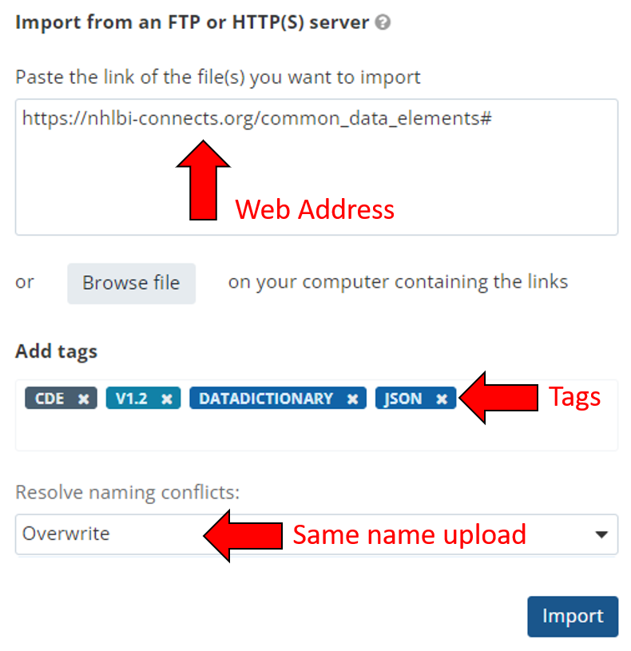
</p>

#### 2) The R script for the validation tool
Repeat the process for outlined for the CDE data dictionary here using the link to [GitHub](https://github.rti.org/jstratford/CDE_Harmonization_Validator/blob/dev/check_harmonized_data.R). Select the appropriate metadata tags during the upload proces. 

#### 3) Study Data
Create a directory where study data can be uploaded for the analysis. To create a new directory click on the "New folder" button in the upper right of the window, then follow the prompts to give the directory a name. We typically recommend that you include the date in the directory name as there may be multiple uploads as issues are identified by the validation script are addressed. 

<p align="left">
  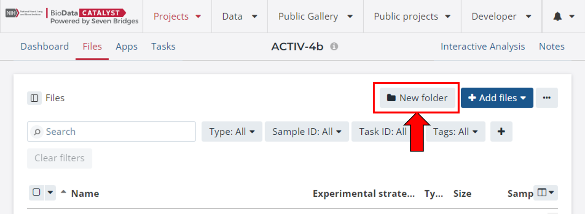
</p>

Click on the newly created directory and the window will update the path to show that you are inside this directory. Now click on the "+ Add file" button in the upper right of the window. From the drop down select the appropriate method. Typically this will be from the local machine of the user. Either browse to or drag and drop the .csv formatted files containing the study data into the window. There should be one .csv file for each of the CDE domains that were mapped.  

<p align="left">
  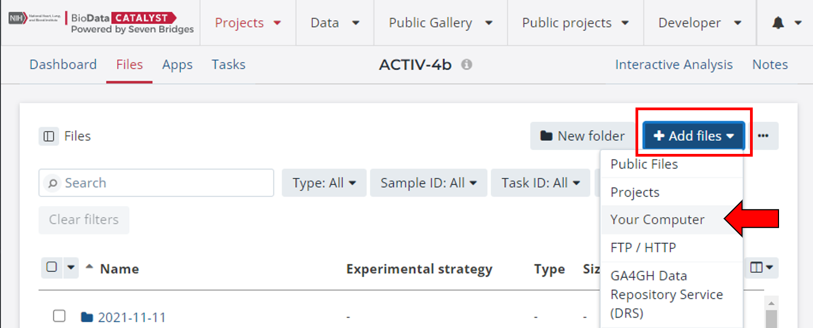
</p>

## Cloud Computing Setup
In order to run the script at BDC you need to setup a cloud computing instance for interactive analysis. This setup only needs to be done once and the cloud instance can be turned on and off as needed. 

1. In the upper right hand corner of the landing page select "Interactive Analysis"
<p align="left">
  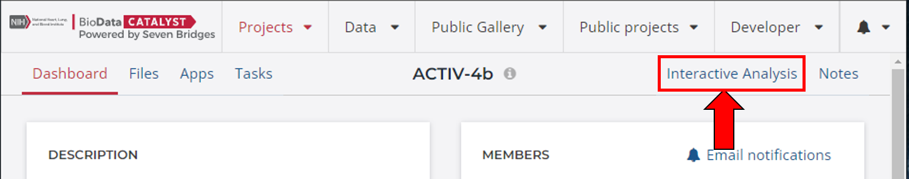
</p>

2. The step in the setup is to select "Data Cruncher" 
<p align="left">
  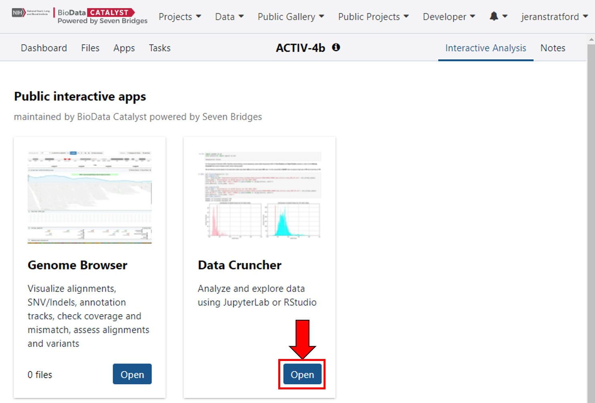
</p>

3. The next screen shows all of the data cruncher sessions that you have setup up. Initially this screen will just be blank but will become populated with instances that you create. This is also a place where you can relaunch existing analyses. First we need to create the cloud computing instance. Click on "Create new analysis" in the upper right hand corner of the screen. 
<p align="left">
  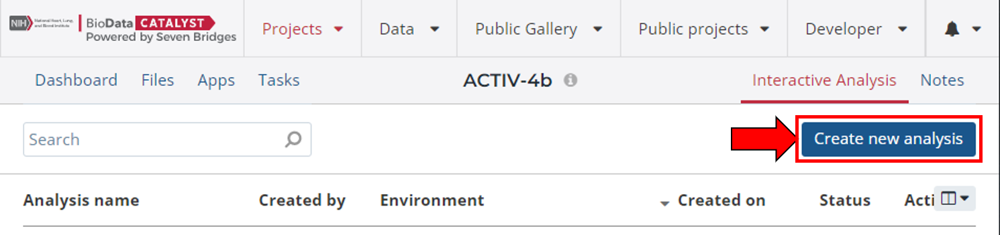
</p>

4. There are three types of pre-configured environments where the programs have already been installed and are ready for use. JupyterLab is for running python scripts. RStudio is for running R scripts, and SAS studio is for running SAS scripts. Give the instance a name in the first field of the form (top red arrow). Next select RStudio as the validation tool is an R script (top red box). From the "Environmental setup" drop down box change the default environment from "SB Bioinformatics - R 4.0" to "SB Bioinformatics - R 4.1" (bottom red box and arrow) and then click "Next".
<p align="left">
  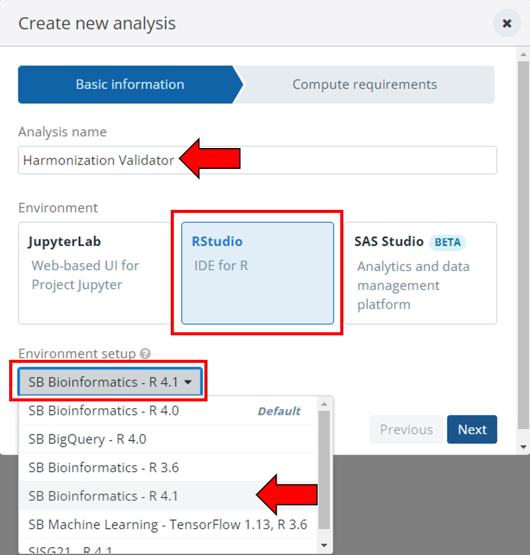
</p>

5. There are several different types of cloud computing resources available to power the instance. The cost of the instance per hour increases with higher resource requirements. In addition, the available instance types have been optimized for [specific tasks](https://docs.aws.amazon.com/AWSEC2/latest/UserGuide/instance-types.html). 

| Instance Type Prefix | Optimized for | 
|:--:|:--:|
|C|Compute|
|D|Storage|
|G|Accelerated Computing|
|I|Storage Optimized|
|M|General Purpose|
|P|Accelerated Computing|
|R|Memory Optimized|
|X|Memory Optimized|

The script itself is fairly lightweight in terms of compute requirements. Datasets are read into memory but most datasets are not sufficiently large as to justify additional resources. It is recommended to use a general purpose instance with resources similar to a typical laptop. We recommend either m4.large or m4.xlarge. This can be selected from the "Instance type" drop down (upper red arrow). We do recommend keeping the "Suspend time" option set to "On" as this will prevent amassing unnecessary costs from inactive instances. You can adjust the suspend time as you see fit (red box). Then select "Start the analysis" (lower red arrow). 

<p align="left">
  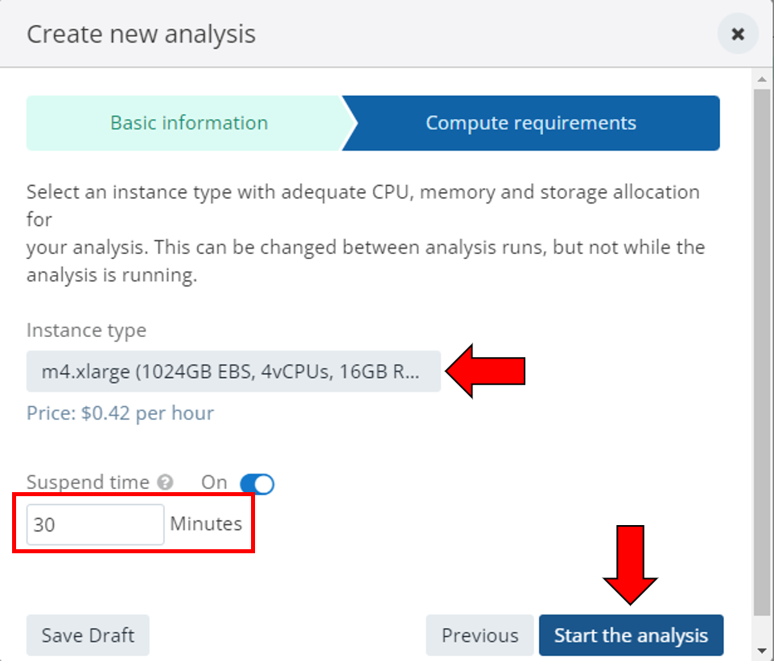
</p>

This will stand up the cloud instance, but it may take several minutes to allocate the resources and setup the environment. The system will send you an email when the environment is ready for use. 
<p align="left">
  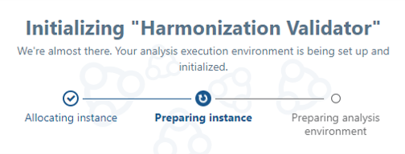
</p>

## File System
The file system inside the cloud instance is segregated into three directories. 
| Directory | Permissions | Purpose | 
|l|l|l|
|project-files|Read only|This is all of the files that are associated with the project|
|workspace|Read, Write, Execute|This is the temporary working space used during analysis. Files in this directory are lost when the instance is stopped. |
|output-files|Read, Write, Execute|This is files that will be saved and available after the isntance is stopped. Prior to closing the instance, move desired files from the workspace to output-files.|

When exiting an interactive session, if a file is named the same as a file in the project files, it will rename the new file as \_[NUM]\_[FILENAME]. For instance, if I have test.txt in my project files, and I create a new test.txt in the output-files during an interactive session, the new test.txt becomes \_1\_test.txt when the data is transferred from output-files to project files upon exit. This will happen with the .RData files as well.

## Usage
Once the instance is instantiated you can return to the web browser window to see a familiar R Studio setup just like desktop R Studio. The validation tool was designed to run on the linux command line. The R Studio environment has already been configured to provide you access to the linux terminal. To access the command line just click on the "Terminal" tab at the top. 
<p align="left">
  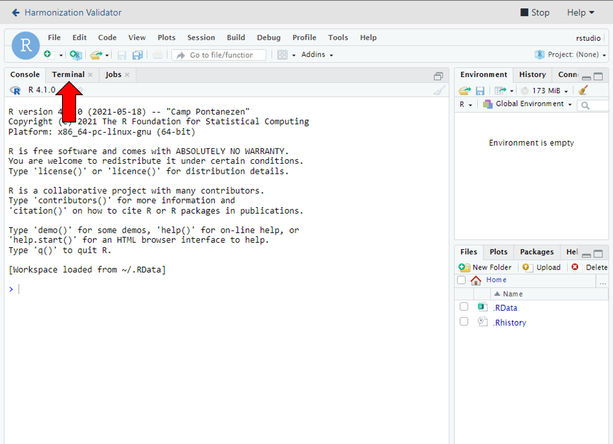
</p>

The version of R within this environment is vanilla and does not contain any installed packages. In order to run the script there is three R packages that need to be installed: getopt, jsonlite, and openxlsx. The script will install these packages for you, however, you need to setup the environment to be able to access the [CRAN package repository](https://cran.r-project.org/). 

Copy and paste this command into the linux terminal to tell R where to look when downloading packages
```
echo "r <- getOption('repos'); r['CRAN'] <- 'http://cran.us.r-project.org'; options(repos = r);" > ~/.Rprofile
```
After issuing the above command, to run the script you will issue a command such as this, but providing the correct path to the R script. If you saved the script into the main project directory then the path is /sbgenomics/project-files/. 
```
Rscript /sbgenomics/project-files/check_harmonized_data_BDC.R -h
```
This will display a message indictating that you asked for the help and will display a usage statement outlining the arguments that can be supplied to the script. 

## Example
I setup a BDC project and pull the json formatted data dictionary and R script into the main project directory. I create a directory named 20220118_harmonized_data and upload the harmonized data for the demographics, medical history, laboratory results and vital signs CDE domains. The data files are named with the following structure \<CDE Domain Abbreviation\>.csv (DM.csv, MH.csv, LB.csv, VS.csv). The study data was collected during an out-patient clinical trial. Then for each domain I can build out the command using the arguments supplied in the usage statement. 

| Required argument | Short Flag | Provided |
|:--|:---:|:-------|
|Path to script| | /sbgenomics/project-files/check_harmonized_data_BDC.R |
|json_dictionary | -j | /sbgenomics/project-files/CONNECTS_DD__V1.21.json |
|infile| -i | /sbgenomics/project-files/20220118_harmonized_data/DM.csv |
|domain| -d | dm |
|study type| -s | OP |
|outpath | -p | /sbgenomics/output-files/|
|excel| -E | \<no input string\> |
|verbose| -V | \<no input string\> |

The issue command to analyze the demographics domain would be as follows:
```
Rscript /sbgenomics/project-files/check_harmonized_data_BDC.R -j /sbgenomics/project-files/CONNECTS_DD__V1.21.json -i /sbgenomics/project-files/20220118_harmonized_data/DM.csv -d dm -s OP -p /sbgenomics/output-files/ -E -V
```

This command can then be slightly modified for each additional domain. For instance, for the medical history domain. 
```
Rscript /sbgenomics/project-files/check_harmonized_data_BDC.R -j /sbgenomics/project-files/CONNECTS_DD__V1.21.json -i /sbgenomics/project-files/20220118_harmonized_data/MH.csv -d MH -s OP -p /sbgenomics/output-files/ -E -V
```

Within the data dictionary there are two domains that contain conditional fields: Laboratory Results (LB) and Vital Signs (VS). Within the data dictionary the conditional fields are listed on the \<Domain\>\_pt2 sheet. The json formatted data dictionary contains the conditional dictionaries for these domains, but we need to point the script to where in the dictionary they reside. So we specify this by using the -c argument. So the commands for these two domains would be:
```
Rscript /sbgenomics/project-files/check_harmonized_data_BDC.R -j /sbgenomics/project-files/CONNECTS_DD__V1.21.json -i /sbgenomics/project-files/20220118_harmonized_data/LB.csv -d LB -s OP -p /sbgenomics/output-files/ -E -V -c LB_PT2

Rscript /sbgenomics/project-files/check_harmonized_data_BDC.R -j /sbgenomics/project-files/CONNECTS_DD__V1.21.json -i /sbgenomics/project-files/20220118_harmonized_data/VS.csv -d VS -s OP -p /sbgenomics/output-files/ -E -V -c VS_PT2
```

## Outputs
For a full description of the inputs and outputs for the tool see [here](https://github.rti.org/jstratford/CDE_Harmonization_Validator/blob/dev/README.md).
